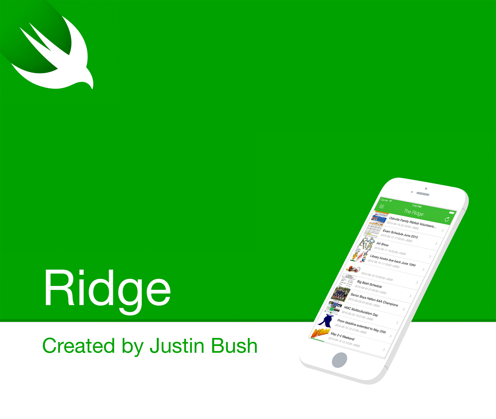

<b>Ridge</b> is an open source project designed to bring the Iroquois Ridge High School experience into the pockets of the students.

## Goals
What began as an observation — that accessing the services provided by Iroquois Ridge were found as somewhat of a challenge to the students using a mobile device. What if one could gather all the fundamentals and piece them together into a single hub with an awesome layout? Introducing, the Ridge app.

### Fundamental Goals
- The IR blog, announcements, etc.
- About the Ridge
- Teacher contact information

### Future Ideas
- Virtual tour of the campus
- Section specific to new parents
- Section specific to aspiring parents
- Club information (feat. signup and contact)
- Sports information (feat. contact)

## Completed
- [x] Full UI Menu Foundation (5 Days)
    - [x] Home
    - [x] Announcements
    - [x] About
    - [x] Ridge Contact
    - [x] Ridge Social
- [ ] Home (Ridge Blog)
    - [ ] RSS Feed
    - [ ] Import Content
    - [ ] Display Content
    - [ ] Image Content Support
- [ ] Announcements
    - [ ] Parse HTML
    - [ ] Display Content
- [ ] About Ridge
    - [ ] Content
- [ ] Ridge Social
    - [ ] Ridge Coaches
    - [ ] Principals
    - [ ] IRHS1
- [ ] Teacher Reference
    - [ ] Teacher List *
    - [ ] Principal List *

## Requirements
Requires iOS 8.0 or later.

## MIT License

Copyright © 2015 Justin Bush. All rights reserved.

```
Permission is hereby granted, free of charge, to any person obtaining a copy
of this software and associated documentation files (the "Software"), to deal
in the Software without restriction, including without limitation the rights
to use, copy, modify, merge, publish, distribute, sublicense, and/or sell
copies of the Software, and to permit persons to whom the Software is
furnished to do so, subject to the following conditions:

The above copyright notice and this permission notice shall be included in
all copies or substantial portions of the Software.

THE SOFTWARE IS PROVIDED "AS IS", WITHOUT WARRANTY OF ANY KIND, EXPRESS OR
IMPLIED, INCLUDING BUT NOT LIMITED TO THE WARRANTIES OF MERCHANTABILITY,
FITNESS FOR A PARTICULAR PURPOSE AND NONINFRINGEMENT. IN NO EVENT SHALL THE
AUTHORS OR COPYRIGHT HOLDERS BE LIABLE FOR ANY CLAIM, DAMAGES OR OTHER
LIABILITY, WHETHER IN AN ACTION OF CONTRACT, TORT OR OTHERWISE, ARISING FROM,
OUT OF OR IN CONNECTION WITH THE SOFTWARE OR THE USE OR OTHER DEALINGS IN
THE SOFTWARE.
```
